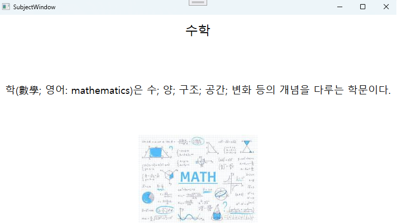

# 🎓 StudentCsvViewer

🖥️ **WPF를 활용한 학생정보 CSV 뷰어 첫 프로젝트**입니다.  
📂 CSV 파일로부터 학생 정보를 읽어와 화면에 출력하는 입사 초기 과제로 점차 구조를 개선해 나가며,  
📊 **MVVM 아키텍처**, **LINQ 정렬**, **CSV 파싱**, **데이터 바인딩**, **팝업 구성** 등을 구현한 실습형 프로젝트입니다.

## 🛠️ 주요 기능

- 📄 `Students.csv`에서 학생 이름, 나이, 전공, 과목별 점수(국어/영어/수학/과학)를 읽어와 List 출력  
- 🔼 UI 상단 라벨을 클릭해 **이름 또는 나이 기준 LINQ 정렬**  
- 🖼️ 과목명을 클릭하면 해당 설명과 이미지를 **새 창(Popup)** 으로 출력  
- 🔄 MVVM 패턴과 `ObservableCollection` 바인딩으로 실시간 UI 동기화

## 🚀 실행 방법

1. 🧑‍💻 Visual Studio에서 솔루션 열기  
2. 📁 `Students.csv`와 `과목.csv`를 **프로젝트 루트**에 위치  
3. 🖼️ `국어.png`, `영어.png` 등의 이미지 파일도 함께 배치  
4. ▶️ 실행 (F5)

## 📸 결과 화면

| 메인 화면 | 과목 상세 |
|-----------|-----------|
|  |  |

## 🗂️ 포함 파일 구성

- MainWindow.xaml / MainWindow.xaml.cs : 메인 UI 및 정렬 이벤트 처리
- SubjectWindow.xaml / SubjectWindow.xaml.cs : 과목 설명 이미지 팝업 창
- Students.cs / Subject.cs : 학생 / 과목 데이터 클래스
- CSVParser.cs : CSV 파일 로딩 유틸리티
- MainViewModel.cs : MVVM ViewModel / LINQ 정렬 처리 담당
- Students.csv / Subject.csv : 샘플 원본 데이터
- images/ : 이미지 리소스 및 결과 스크린샷
- .gitignore, .sln : Visual Studio 프로젝트 설정

> 📌 .sln(솔루션) 파일은 GitHub에 포함되어 있어 Visual Studio에서 바로 열 수 있습니다.

## 🔁 업데이트 내역

- ✅ MVVM 구조 도입 및 ViewModel 분리
- ✅ LIQN문 정렬 적용
- ✅ 반복되는 코드 리팩토리 하여 단순화 진행

## 🗂️ 향후 개선 방향

- 💬 클릭 이벤트를 `ICommand`로 바인딩 (MVVM 완성도 향상)
- 🔍 고급 필터/검색 기능 (예: 점수 범위, 전공 필터)
- 💾 JSON 또는 SQLite 기반 데이터 저장 전환 : 확장성과 데이터 무결성 확보
- 🌐 다국어 전환 기능 (한/영 UI 스위치)
- 📊 성적 평균, 최고점, 최저점 등 통계 시각화 추가
- 🖱️ Drag & Drop 지원으로 CSV 파일 간편 로드
- 📈 통계 뷰 추가: 평균 성적, 최고/최저 점수 등을 시각화
- 💬 ToolTip 및 상태바 추가: 사용자 편의성 향상

## 🙌 마무리
이 프로젝트는 **단순한 CSV 뷰어**에서 시작해  
**MVVM 패턴**, **LINQ 정렬**, **동적 바인딩**, **UI 분리 설계** 등을 경험하며  
WPF에 대한 이해를 실무적으로 넓힐 수 있었던 **의미 있는 첫 업무 과제**였습니다.

📌 이 코드는 포트폴리오용으로 정리된 프로젝트이며,  
입사 초기 과제를 바탕으로 실제 적용 가능한 구조로 리팩토링한 결과물입니다.
