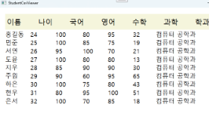
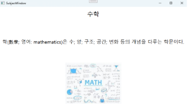

# 🎓 StudentCsvViewer

🖥️ **WPF를 활용한 학생정보 CSV 뷰어 첫 프로젝트**입니다.  
📂 입사 초기 과제로 진행되었으며, CSV 파일로부터 학생 정보를 읽어와 화면에 출력하고,  
📊 각 항목(이름, 나이 등)을 클릭하여 정렬하며, 과목별 상세 정보를 별도의 창에서 확인할 수 있습니다.

## 🛠️ 주요 기능
- 📄 `Students.csv` 파일에서 이름, 나이, 성적, 전공 정보를 읽어와 테이블로 표시  
- 🔼 Label 클릭으로 **이름 또는 나이 기준 정렬**  
- 📚 과목(국어, 영어 등) 클릭 시 ✨새 창✨에서 과목 설명 + 이미지 출력  

## 💡 개발 배경
이 코드는 회사에서 첫 업무로 받은 과제였으며,  
*CSV 기반 데이터 가공 및 시각화 처리*를 연습하고 실제 업무에 적용해보는 데 큰 도움이 되었습니다.  
처음부터 직접 기획하고 구성하면서 **클래스 분리**, **데이터 파싱**, **UI 요소 생성**, **툴팁 처리**, **색상 매핑** 등을 경험할 수 있었습니다.

## 🚀 실행 방법

1. 🧑‍💻 Visual Studio에서 솔루션 열기  
2. 📁 `Students.csv`와 `과목.csv`를 **프로젝트 루트**에 위치  
3. 🖼️ `국어.png`, `영어.png` 등의 이미지 파일도 함께 배치  
4. ▶️ 실행 (F5)

## 📸 결과 화면
 

## 🗂️ 포함 파일 구성
- MainWindow.xaml, MainWindow.xaml.cs : 메인 화면 및 로직
- Student.cs, Subject.cs : 학생 및 과목 속성 클래스
- CSVParser : CSV 파일 읽기 및 문자열 저장
- Studend.csv / Subject.csv : 시각화 대상 원본 데이터
- README.md : 프로젝트 설명 문서
- .gitignore : Visual Studio 설정 및 빌드 결과물 제외
- images/main.png , images/subject.png : 결과 화면 스크린

> 📌 .sln(솔루션) 파일은 GitHub에 포함되어 있어 Visual Studio에서 바로 열 수 있습니다.

## 🗂️ 향후 개선 방향

🏗️ MVVM 아키텍처 적용: UI와 로직을 분리하여 유지보수성과 테스트 용이성 향상

🔍 LINQ를 활용한 고급 정렬 및 필터링 기능 추가

💾 CSV → SQLite 또는 JSON 전환: 확장성과 데이터 무결성 확보

🌐 다국어 지원 (예: 한/영 UI 전환 기능 추가)

📈 통계 뷰 추가: 평균 성적, 최고/최저 점수 등을 시각화

🖱️ Drag & Drop 지원: CSV 파일을 UI로 끌어다 놓아 자동 로드

💬 ToolTip 및 상태바 추가: 사용자 편의성 향상

## 🙌 마무리
작지만 WPF의 핵심 기능들을 다뤄본 좋은 경험이었고, 
WPF의 핵심 기능들(데이터 바인딩, 이벤트 처리, 윈도우 간 데이터 전달 등)을 실제로 구현해보며  
업무 데이터를 어떻게 시각적으로 표현할 수 있을지에 대한 기초를 배운 의미 있는 경험이었습니다.

📌 이 프로젝트는 제 개인 포트폴리오의 일부이며, 실제 업무 환경에서 처음으로 맡은 개발 과제를 기반으로 구현하였습니다.
